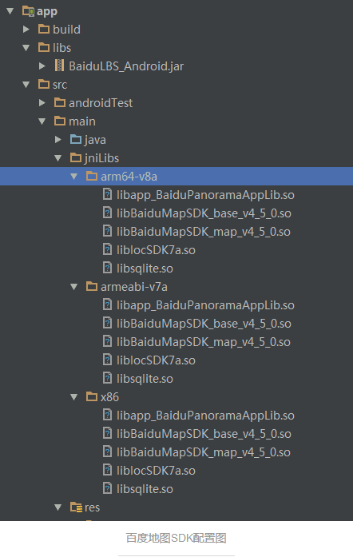
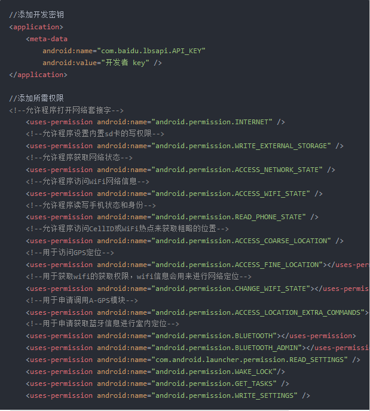
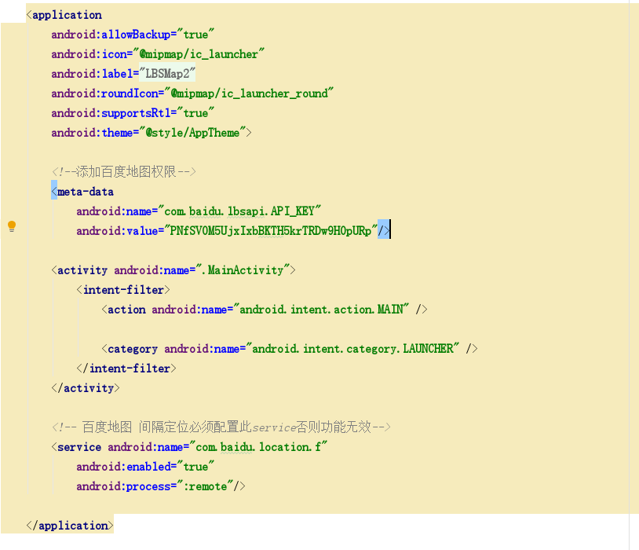
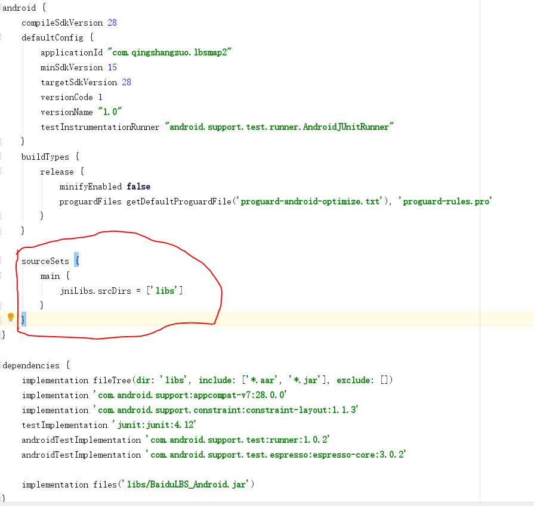
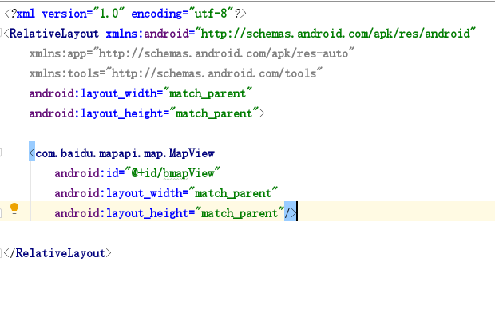
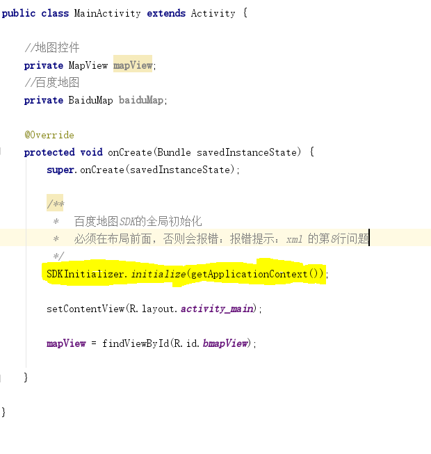
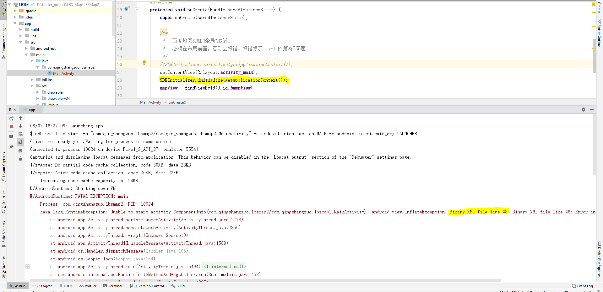

# LBSMap2
百度地图的实现

一、申请密钥

   百度开放平台地址：http://lbsyun.baidu.com/index.php?title=%E9%A6%96%E9%A1%B5

二、配置环境

   首先，我们要去下载需要的开发包
   然后，就是把下载好的 jar 包放入 app 下 libs 文件夹里，并且右键 Add As Library。
   随后在 main 目录下新建一个 jniLibs 文件夹，把 so 文件放进去。配置图如下：

   

   注意：有时候这样配置运行不了，可以试下把 so 文件也放入到 libs （有时候这样可以解决一个问题）

三、显示地图

   1.经过以上两步，地图SDK最基本的工作已经做完了，接下来就要对代码进行一些初始化编写来显示地图。
   首先在AndroidManifest.xml配置文件里进行配置：

   

       以上，对于AndroidManifest.xml的配置就完成了，但是值得注意的是，如果需要用到间隔定位功能（每隔n秒定位一次），则需要多配置一个service。
   这也算是踩的一个坑，我做间隔定位的时候死活不行，看遍了百度地图api都没有找到对应的解决方法，最后搜了好久才解决了这个问题，再次鄙视百度地图api。
   service配置如下：
   
   

   添加的位置：

   

   由于我的so文件是用了arm64-v8a,armeabi-v7a,x86所以在build.gradle里额外配置一句：

   

   2.在我们的布局文件里添加百度地图控件：
   
   

   3.新建一个全局的MyApplication类进行初始化，并将其配置进AndroidManifest.xml文件里：

   

四、按照步骤，就可以实现百度地图的展现

会遇到的报错：

解决方法：
     
     只要把 SDKInitializer.initialize(getApplicationContext()); 移到 setContentView(R.layout.activity_main);的
   上方，就可以解决这个问题并且可以显示地图成功

 资料：https://www.jianshu.com/p/f334cc6fd7af

