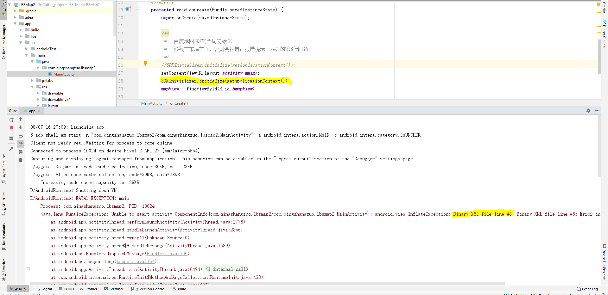

# LBS-Map
百度地图的实现

会遇到的报错：

第一：

解决方法：
     
     只要把 SDKInitializer.initialize(getApplicationContext()); 移到 setContentView(R.layout.activity_main);的
   上方，就可以解决这个问题并且可以显示地图成功

第二：

出现该问题，是因为库出现冲突

解决方法：

使 (com.android.support:support-compat:28.0.0) 和 (com.android.support:support-v4:23.1.1) 保持一致（唯一性）

 资料：https://www.cnblogs.com/renhui/p/10767721.html

